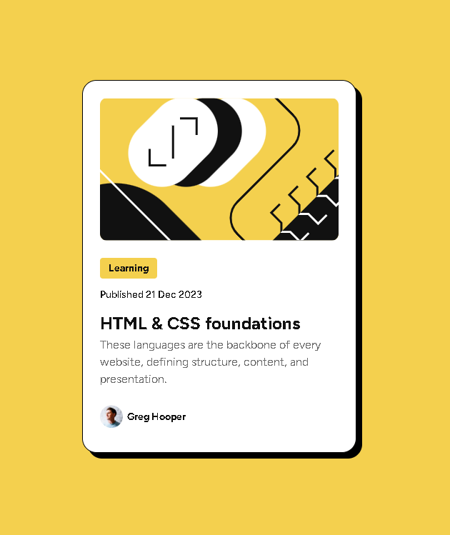

# Frontend Mentor - Solução para cartão de pré-visualização de blog

Esta é a minha solução para o desafio  [Blog preview card challenge on Frontend Mentor](https://www.frontendmentor.io/challenges/blog-preview-card-ckPaj01IcS) do Frontend Mentor.  
Os desafios do Frontend Mentor ajudam a aprimorar habilidades de codificação através da criação de projetos realistas e focados em boas práticas de desenvolvimento.

## 🗂️ Índice

- [Visão Geral](#visão-geral)
  - [Captura de Tela](#captura-de-tela)
  - [Links](#links)
- [Meu Processo](#meu-processo)
  - [Construído com](#construído-com)
  - [O que Aprendi](#o-que-aprendi)
  - [Desenvolvimento Contínuo](#desenvolvimento-contínuo)
- [Autor](#autor)
- [Contato](#contato)

---

## 📋 Visão Geral

### Captura de Tela

### Links

- URL do site publicado: [Clique aqui](https://guilherme-ddiniz.github.io/blog-preview-card-main/)

---

## 🚀 Meu Processo

### Construído com

- HTML5 semântico
- CSS3 com propriedades personalizadas (CSS Variables)
- Flexbox para layout responsivo
- Fluxo de trabalho Desktop-first
- Controle de versão com Git

### O que Aprendi

- Este projeto proporcionou uma excelente oportunidade para aprimorar meus conhecimentos em HTML5 e CSS3. Também reforcei as práticas de versionamento com Git e expandi meu domínio sobre novas propriedades de CSS, como box-shadow e :focus, entre outras.

### Desenvolvimento Contínuo

- Meu objetivo é continuar aprimorando o uso do Git e do GitHub, tornando o processo de versionamento cada vez mais fluido e eficiente. Além disso, busco consolidar e expandir meus conhecimentos em HTML5 e CSS3, visando desenvolver interfaces ainda mais robustas e modernas.

---

## 👨‍💻 Autor

- GitHub - [Guilherme-dDiniz](https://github.com/Guilherme-dDiniz)
- Frontend Mentor - [@Guilherme-dDiniz](https://www.frontendmentor.io/profile/Guilherme-dDiniz)
